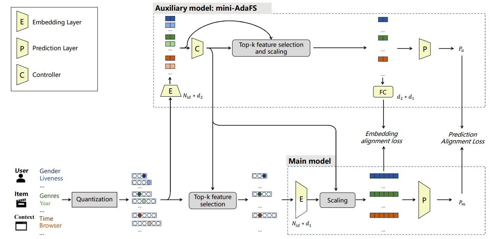

# AEFS: Adaptive Early Feature Selection for Deep Recommender Systems

Source code of AEFS.




## Environment

We used Anaconda to setup a deep learning workspace that supports PyTorch. Run the following script to install all the required packages.

```sh
conda create -n AEFS python==3.8
conda activate AEFS

download this_project

cd  AEFS
pip install -r requirements.txt
```

## Dataset

We follow [AdaFS](https://github.com/Applied-Machine-Learning-Lab/AdaFS) pre-process progress for avazu and criteo. Please download the dataset from the official website, then unzip it and put it in the `./dataset` directory.

## Training

Run the following code to train the model:


```
bash ./shell/AEFS_avazu.sh
```

Note that the AEFS selects 50% features by default. Please feel free to change it with hypereparameter *k*.


## Additional experiments

Please refer to  [add_experiments](add_experiments.md).


## Acknowledgments

The implementation of AEFS relies on resources from  [AdaFS](https://github.com/Applied-Machine-Learning-Lab/AdaFS). We thank the original authors for their open-sourcing.

Please feel free to contact us after the project is open.